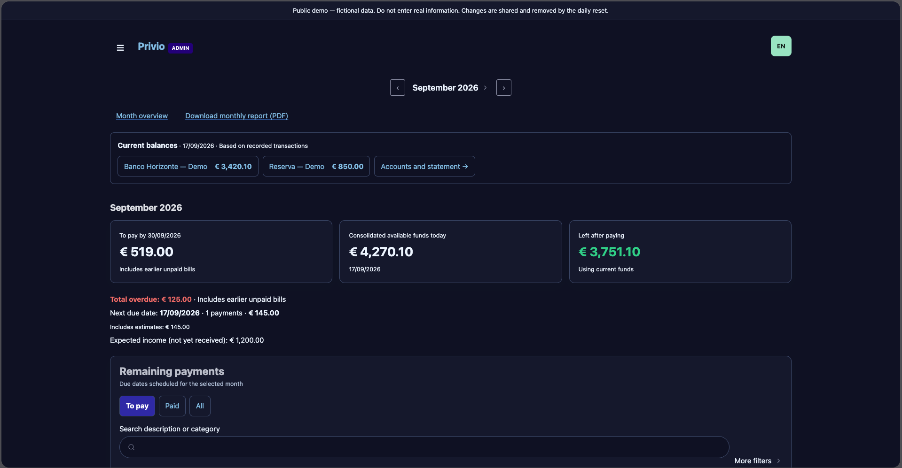
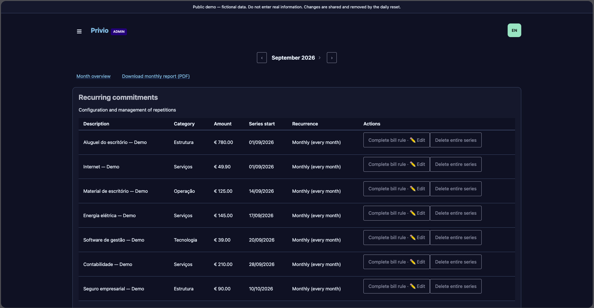
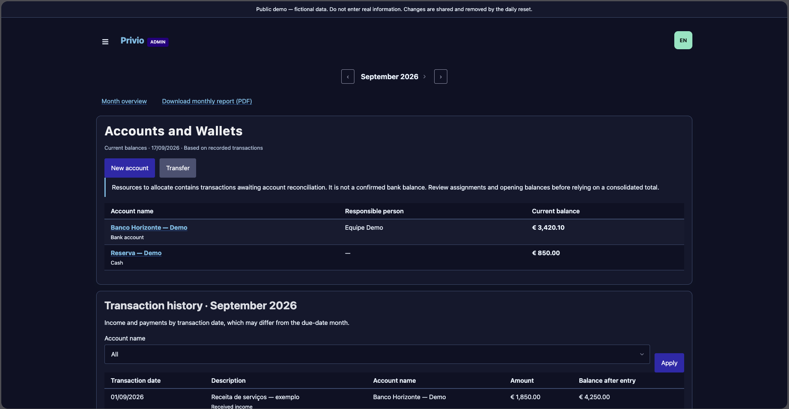
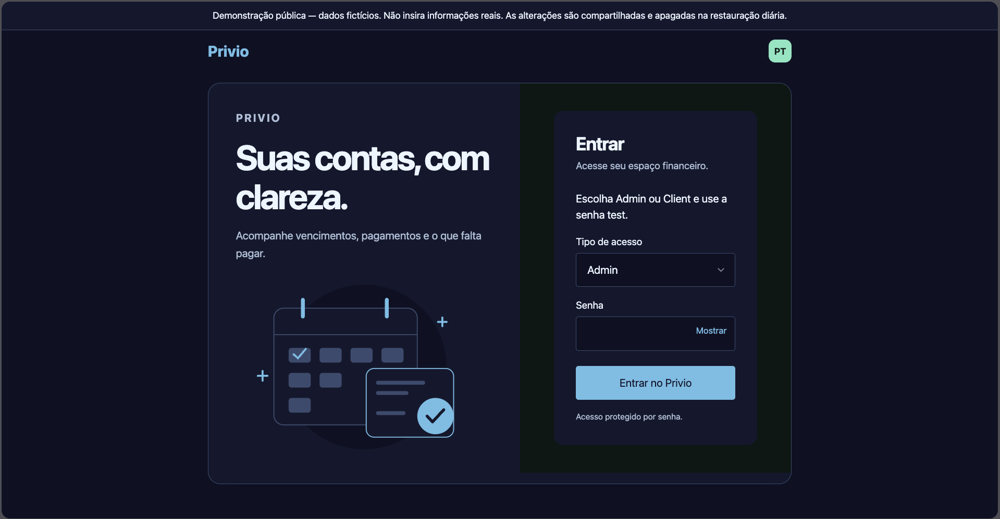
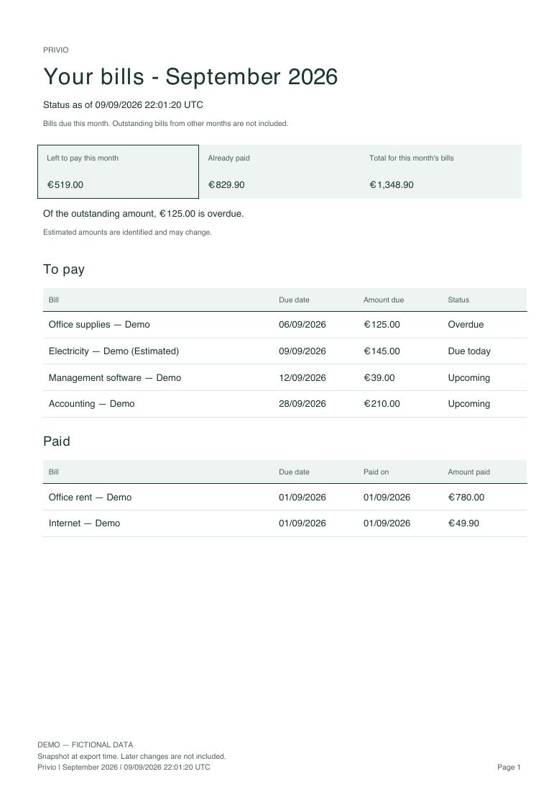
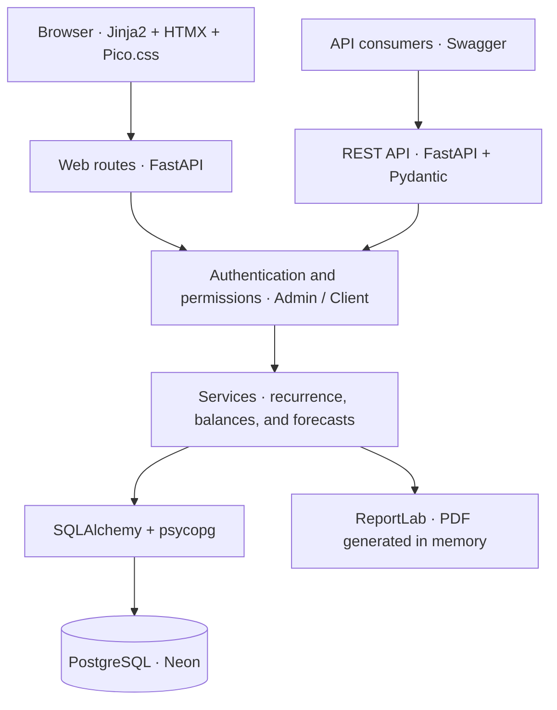

# Privio

**A clear view of what is due, what is paid, and the money available.**

Privio is a web application for managing financial commitments, tracking due dates,
and viewing balances and forecasts. It connects the work of the person managing
bills with a simple overview for the person following payments.


[Live demo](https://privio-demo.onrender.com/) ·
[API documentation](https://privio-demo.onrender.com/docs) ·
[Technical documentation](docs/README.md)

## What Privio demonstrates

- **Monthly overview:** outstanding bills, completed payments, available balance,
  and the amount remaining or missing to cover commitments.
- **Recurring bills:** one-time, weekly, monthly, semiannual, and annual expenses,
  with adjustments to an individual occurrence or the entire series.
- **Payments and income:** actual amounts and dates, linked financial accounts,
  and a distinction between expected and received income.
- **Accounts and reserves:** balances across multiple accounts and internal transfers.
- **Forecasts:** six-month cash flow and a twelve-month commitments schedule.
- **Monthly PDF report:** bills, amounts, due dates, paid and outstanding totals,
  and an export timestamp. Each report is generated on demand and reflects the
  information available at the time of export.
- **Two roles:** Admin for management and Client for viewing, with permissions
  enforced on the server.
- **Responsive interface:** English, Portuguese, and Italian; light, dark, and
  system themes on authenticated pages.
- **Production architecture:** FastAPI, PostgreSQL, server-side authorization,
  a service layer for financial rules, and generated PDF reports.
- **Quality gates:** automated Python, browser, and PostgreSQL integration tests
  run in GitHub Actions.

## Screenshots

All screenshots show the demo with fictional data.

### Admin dashboard



### Recurring commitments



### Accounts and transaction history



<details>
<summary>Login and monthly PDF report</summary>



[Open the September 2026 demo report](https://privio-demo.onrender.com/reports/monthly.pdf?month=2026-09&lang=en)



</details>

## Public demo

Open **[privio-demo.onrender.com](https://privio-demo.onrender.com/)**.
On the login screen, select **Admin** or **Client** and enter the password `test`.
The interface supports English, Portuguese, and Italian through the language selector.

| Role | API username | Password | Access |
| --- | --- | --- | --- |
| **Admin** | `admin` | `test` | Manage bills, income, and payments; view forecasts and export reports. |
| **Client** | `client` | `test` | View bills, balances, and forecasts; export monthly reports. |

The same credentials work with HTTP Basic authentication in the API. They are
public and intended only for the demonstration.

> Data is fictional and shared among visitors. Do not enter real information.
> Sample data is restored daily at approximately **03:17 UTC**, so changes are
> temporary. After inactivity, the first request may take about a minute while
> the service starts, depending on the hosting plan in use.

## Architecture

Privio uses a layered FastAPI application. Web routes serve HTML pages rendered
with Jinja2, while HTMX updates sections of the interface using server responses.
The REST API provides structured access to commitments, deposits, and financial queries.



Financial rules live in the service layer. SQLAlchemy models represent commitments,
payments, deposits, and accounts, while Pydantic schemas validate API inputs and
responses. Monetary values use `Decimal`.

Web login uses signed session cookies; the API supports HTTP Basic authentication.
Application settings are supplied through environment variables.

## Technology stack

| Layer | Technologies |
| --- | --- |
| Language and server | Python 3.11+, FastAPI, Uvicorn (CI runs on Python 3.12) |
| Interface | Jinja2, HTMX, Pico.css, JavaScript |
| Persistence | PostgreSQL, SQLAlchemy 2, psycopg 3 |
| Validation and configuration | Pydantic, pydantic-settings |
| Reports | ReportLab |
| Dependencies | uv and a version-controlled lockfile |
| Quality | pytest, HTTPX, Ruff, ty, JavaScript tests with Node.js |
| Continuous integration | GitHub Actions, tests with an isolated PostgreSQL database |
| Hosting | Render for the application, Neon for the database |

## Project structure

```text
app/
├── routers/       # Web routes, API, and report exports
├── services/      # Financial rules, recurrence, and PDFs
├── models/        # Persistence models
├── schemas/       # Input and response validation
├── templates/     # HTML pages and components
├── auth.py        # Authentication and access control
├── config.py      # Environment-based configuration
├── database.py    # Database connections and sessions
├── i18n.py        # English, Portuguese, and Italian translations
└── main.py        # FastAPI application
scripts/           # Database setup and demo maintenance
tests/             # Automated tests
docs/              # Technical documentation and images
.github/workflows/ # Continuous integration and demo data reset
```

## Run locally

Requirements: Python 3.11 or later, [uv](https://docs.astral.sh/uv/), and a PostgreSQL database
dedicated to development.

```bash
git clone https://github.com/medioalanum/privio.git
cd privio
cp .env.example .env
uv sync --frozen --all-groups
```

In `.env`, configure `DATABASE_URL`, development usernames and passwords, and your
own `SESSION_SECRET`. Keep `DEMO_MODE=false` for regular local development.

```bash
uv run python -m scripts.migrate
uv run uvicorn app.main:app --reload
```

The interface is available at `http://127.0.0.1:8000`, with Swagger at `/docs`.

## Quality checks

```bash
uv run ruff check .
uv run ruff format --check .
uv run ty check .
uv run pytest
node --test tests/browser/*.test.mjs
```

JavaScript tests require Node.js 22 or later. GitHub Actions also runs integration
tests against an isolated PostgreSQL database.

## Further documentation

For data model details, API behavior, deployment notes, and operational guides,
see the [technical documentation](docs/README.md).
